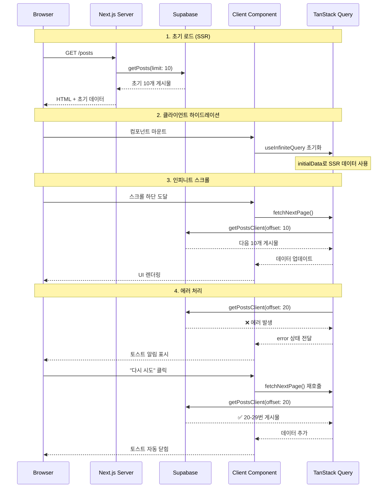
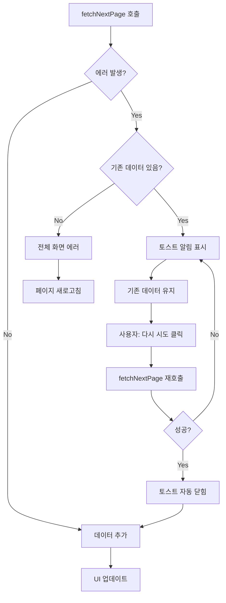

## 개요

인스타그램과 같은 피드를 구현할 때 중요한 것은 **초기 로딩 속도**와 **인피니트 스크롤 경험**입니다. 이 글에서는 Next.js App Router 환경에서 Supabase를 활용한 SSR과 TanStack Query의 `useInfiniteQuery`를 사용하여 최적화된 포스트 피드를 구현하는 방법을 소개합니다.

| 정상 | 재시도 |
|:---:| :---:|
|  |  | 

## 아키텍처 설계

### 데이터 흐름



### 설계

1. **SSR로 초기 데이터 제공**: SEO와 첫 화면 렌더링 속도 최적화
2. **클라이언트에서 인피니트 스크롤**: 사용자 경험을 위한 부드러운 데이터 로드
3. **에러 복구**: 기존 데이터를 유지하면서 재시도 가능

## 구현 상세

### 1. 서버 사이드 데이터 페칭 (SSR)

Next.js App Router의 서버 컴포넌트에서 초기 데이터를 가져옵니다.

```tsx
// src/app/posts/page.tsx
import { createClient } from '@/shared/lib/supabase/server';
import { getPosts } from '@/entities/post';
import { PostFeedInfinite } from '@/features/post-feed';

export const dynamic = 'force-dynamic';
export const revalidate = 0;

export default async function PostsPage() {
  const supabase = await createClient();

  // SSR: 서버에서 초기 데이터 패칭 (첫 10개)
  const initialPosts = await getPosts(supabase, {
    limit: 10,
    isPublic: true,
  });

  return (
    <Container maxWidth="sm" disableGutters>
      <PostFeedInfinite initialPosts={initialPosts} isPublic />
    </Container>
  );
}
```

**핵심 포인트:**
- `force-dynamic`: 매 요청마다 새로운 데이터 페칭
- `revalidate: 0`: 캐싱 비활성화 (실시간 데이터)
- 서버 컴포넌트에서 Supabase 서버 클라이언트 사용

### 2. Supabase 페이지네이션 API

Supabase의 `range()` 메서드를 활용한 offset 기반 페이지네이션입니다.

```typescript
// src/entities/post/api/get-posts.ts
export async function getPosts(supabase: SupabaseClient, options: GetPostsOptions = {}) {
  const { limit = 20, offset = 0, userId, isPublic = true } = options;

  let query = supabase
    .from('posts')
    .select(`
      id,
      user_id,
      title,
      content,
      location_name,
      likes_count,
      comments_count,
      created_at,
      profiles!user_id (
        username,
        display_name,
        avatar_url
      ),
      post_images (
        id,
        image_url,
        thumbnail_url,
        display_order
      )
    `)
    .order('created_at', { ascending: false })
    .range(offset, offset + limit - 1);

  if (isPublic !== undefined) {
    query = query.eq('is_public', isPublic);
  }

  const { data, error } = await query;
  if (error) throw error;

  return data as Post[];
}
```

**페이지네이션 동작:**
- `range(0, 9)`: 0-9번 인덱스 (첫 10개)
- `range(10, 19)`: 10-19번 인덱스 (다음 10개)
- `range(20, 29)`: 20-29번 인덱스 (그 다음 10개)

### 3. TanStack Query 인피니트 스크롤 훅

`useInfiniteQuery`를 래핑한 커스텀 훅으로 인피니트 스크롤 로직을 캡슐화합니다.

```typescript
// src/features/post-feed/hooks/use-infinite-posts.ts
import { useInfiniteQuery } from '@tanstack/react-query';
import { getPostsClient } from '@/entities/post/api/get-posts-client';
import { POSTS_PER_PAGE } from '@/shared/config/pagination';

interface UseInfinitePostsOptions {
  initialData?: Post[];
  isPublic?: boolean;
  userId?: string;
}

export function useInfinitePosts(options: UseInfinitePostsOptions = {}) {
  const { initialData, ...restOptions } = options;

  return useInfiniteQuery({
    queryKey: ['posts', 'infinite', restOptions],

    queryFn: async ({ pageParam }: { pageParam: number }) => {
      const posts = await getPostsClient({
        ...restOptions,
        limit: POSTS_PER_PAGE,
        offset: pageParam,
      });
      return posts;
    },

    getNextPageParam: (lastPage, allPages) => {
      // 마지막 페이지의 게시물 수가 POSTS_PER_PAGE보다 적으면 더 이상 페이지 없음
      if (lastPage.length < POSTS_PER_PAGE) {
        return undefined;
      }
      // 다음 페이지의 offset 반환
      return allPages.length * POSTS_PER_PAGE;
    },

    initialPageParam: 0,

    // 서버에서 가져온 초기 데이터 사용
    ...(initialData && {
      initialData: {
        pages: [initialData],
        pageParams: [0],
      },
    }),
  });
}
```

**주요 메커니즘:**
- `queryKey`: 쿼리 캐싱 및 무효화를 위한 고유 키
- `pageParam`: 현재 페이지의 offset 값
- `getNextPageParam`: 다음 페이지 존재 여부 판단
- `initialData`: SSR 데이터를 첫 페이지로 설정

### 4. IntersectionObserver로 인피니트 스크롤 트리거

화면 하단 도달 시 자동으로 다음 페이지를 로드합니다.

```tsx
// src/features/post-feed/ui/post-feed-infinite.tsx
export function PostFeedInfinite({ initialPosts, isPublic = true }: PostFeedInfiniteProps) {
  const { data, fetchNextPage, hasNextPage, isFetchingNextPage } = useInfinitePosts({
    initialData: initialPosts,
    isPublic,
  });

  const posts = data?.pages.flatMap((page) => page) ?? [];

  return (
    <Box sx={{ bgcolor: '#000000', minHeight: '100vh' }}>
      {/* 게시물 목록 */}
      {posts.map((post) => (
        <PostCard key={post.id} post={post} />
      ))}

      {/* 인피니트 스크롤 트리거 */}
      {hasNextPage && (
        <InView
          onChange={(inView: boolean) => {
            if (inView && !isFetchingNextPage) {
              fetchNextPage();
            }
          }}
        >
          {(_inView: boolean, ref: (node?: Element | null) => void) => (
            <Box ref={ref} sx={{ py: 4, textAlign: 'center' }}>
              {isFetchingNextPage && <CircularProgress sx={{ color: 'white' }} size={32} />}
            </Box>
          )}
        </InView>
      )}

      {/* 더 이상 게시물이 없을 때 */}
      {!hasNextPage && posts.length > 0 && (
        <Box sx={{ py: 4, textAlign: 'center' }}>
          <Typography variant="body2" color="rgba(255, 255, 255, 0.5)">
            모든 게시물을 확인했습니다.
          </Typography>
        </Box>
      )}
    </Box>
  );
}
```

**IntersectionObserver 동작:**
- 하단 200px 전에 미리 로딩 시작 (`rootMargin="200px"`)
- `inView`가 `true`가 되면 `fetchNextPage()` 호출
- `isFetchingNextPage`로 중복 요청 방지

## 에러 핸들링

### 에러 상태 관리



### 구현 코드

```tsx
export function PostFeedInfinite({ initialPosts, isPublic = true }: PostFeedInfiniteProps) {
  const [showErrorToast, setShowErrorToast] = useState(false);
  const prevErrorRef = useRef<Error | null>(null);

  const { data, fetchNextPage, error } = useInfinitePosts({
    initialData: initialPosts,
    isPublic,
  });

  const posts = data?.pages.flatMap((page) => page) ?? [];

  // 에러 상태 변경 시 토스트 표시/숨김
  useEffect(() => {
    // 새로운 에러가 발생했을 때만 토스트 표시
    if (error && error !== prevErrorRef.current && posts.length > 0) {
      setShowErrorToast(true);
      prevErrorRef.current = error;
    }
    // 에러가 해결되면 토스트 닫기
    else if (!error && prevErrorRef.current) {
      setShowErrorToast(false);
      prevErrorRef.current = null;
    }
  }, [error, posts.length]);

  // 에러 처리: 데이터가 없는 경우 전체 에러 화면
  if (error && posts.length === 0) {
    return (
      <Box sx={{ py: 8, textAlign: 'center', bgcolor: '#000000', minHeight: '100vh' }}>
        <Typography variant="h6" color="error" gutterBottom>
          게시물을 불러오는 중 오류가 발생했습니다
        </Typography>
        <Typography variant="body2" sx={{ color: 'rgba(255, 255, 255, 0.7)', mt: 1, mb: 3 }}>
          {error.message}
        </Typography>
        <Button
          variant="contained"
          onClick={() => window.location.reload()}
          sx={{ bgcolor: 'white', color: 'black' }}
        >
          다시 시도
        </Button>
      </Box>
    );
  }

  const handleRetry = () => {
    setShowErrorToast(false);
    fetchNextPage(); // 실패한 페이지 재시도
  };

  return (
    <>
      {/* 게시물 목록 */}
      {posts.map((post) => <PostCard key={post.id} post={post} />)}

      {/* 에러 토스트 */}
      <Snackbar
        open={showErrorToast}
        autoHideDuration={6000}
        onClose={() => setShowErrorToast(false)}
        anchorOrigin={{ vertical: 'bottom', horizontal: 'center' }}
      >
        <Alert
          severity="error"
          variant="filled"
          action={
            <Button color="inherit" size="small" onClick={handleRetry}>
              다시 시도
            </Button>
          }
        >
          {error?.message || '게시물을 불러오는데 실패했습니다.'}
        </Alert>
      </Snackbar>
    </>
  );
}
```

**에러 핸들링:**
1. **데이터 있음**: 토스트 알림 + 기존 데이터 유지
2. **데이터 없음**: 전체 화면 에러 + 새로고침
3. **에러 추적**: `useRef`로 중복 토스트 방지
4. **자동 복구**: 성공 시 토스트 자동 닫힘

## 트러블슈팅

### 문제 1: 토스트가 계속 렌더링됨

**원인**: 에러 상태가 해결되어도 `showErrorToast`가 리셋되지 않음

**해결책**: `useRef`로 이전 에러 추적

```typescript
const prevErrorRef = useRef<Error | null>(null);

useEffect(() => {
  if (error && error !== prevErrorRef.current && posts.length > 0) {
    setShowErrorToast(true);
    prevErrorRef.current = error;
  } else if (!error && prevErrorRef.current) {
    setShowErrorToast(false);
    prevErrorRef.current = null;
  }
}, [error, posts.length]);
```

### 문제 2: `resetQueries`가 모든 데이터를 지움

**원인**: `queryClient.resetQueries()`는 캐시 전체를 초기화

**해결책**: `fetchNextPage()`만 호출 (TanStack Query가 자동으로 실패한 페이지 재시도)

```typescript
const handleRetry = () => {
  setShowErrorToast(false);
  fetchNextPage(); // 기존 데이터 유지하면서 다음 페이지 재시도
};
```

## 마무리

1. **SSR + CSR 하이브리드**: 초기 로딩 속도와 사용자 경험 모두 확보
2. **에러 복구**: 기존 데이터를 유지하면서 재시도 가능
3. **유지보수성**: 페이지네이션 상수와 훅으로 재사용성 향상

전체 코드는 [GitHub 저장소](https://github.com/your-username/garden-bizarre-adventure)에서 확인할 수 있습니다.

