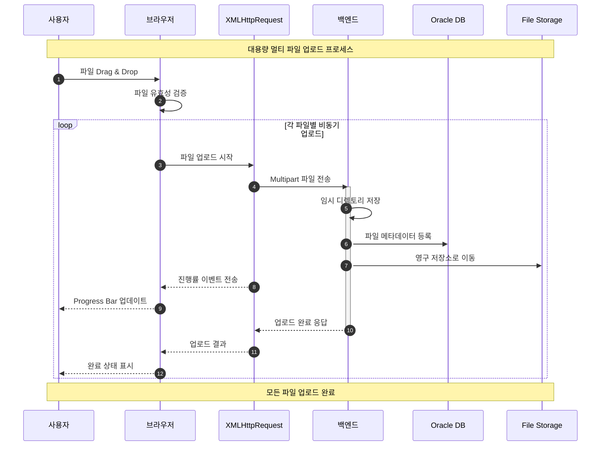
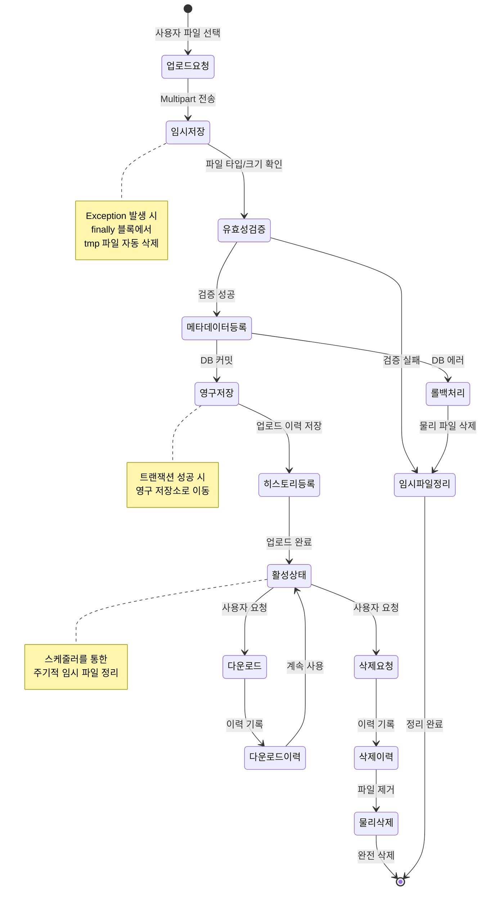

## 프로젝트 개요

신용평가사의 보험/전세 상품에 대한 첨부파일들을 서버로 업로드하여 관리할 수 있는 클라우드 시스템을 구축했습니다. 대용량 멀티 파일 업로드 최적화와 실시간 작업 진행률 모니터링을 통해 업무 효율성을 향상시켰습니다.

## 프로젝트 정보

- **고객사**: 바이릿지
- **포지션**: Front/Back-end
- **개발 인원**: 3명

## 기술 스택

- **Frontend**: JavaScript, jQuery, jqGrid, High Charts
- **Backend**: Java, Spring Framework
- **Database**: Oracle
- **Server**: Linux, Windows

## 주요 과제

### **대용량 멀티 파일 업로드 기능 개발**

- **문제**: Multiple 대용량 첨부파일 업로드 UX 및 진행률 시각화
- **해결**:
  - **Drag & Drop UI**: jQuery 기반 파일 업로드 인터페이스
  - **비동기 멀티 업로드**: Promise 기반 병렬 처리로 업로드 속도 향상
  - **실시간 Progress Bar**: 파일별 업로드 진행률 시각화(XMLHttpRequest)

### **권한 기반 메뉴 관리 시스템**

- **문제**: 역할별 차등 권한 관리 필요
- **해결**:
  - **jqGrid Tree**: Drag & Drop 방식 메뉴 구조 관리
  - **동적 메뉴 렌더링**: 사용자 권한에 따른 메뉴 동적 생성
  - **Oracle 연동**: 권한 및 메뉴 정보 DB 관리

### **실시간 시스템 모니터링 대시보드**

- **문제**: 서버 리소스, 업무 진행률 등 실시간 모니터링 필요
- **해결**:
  - **High Charts**: 서버 스토리지 가용률, DB Pool 상태 실시간 시각화
  - **jQuery AJAX**: 주기적 데이터 폴링으로 실시간 업데이트
  - **보험사/은행별 대시보드**: 의뢰건 및 작업 진행률 현황 제공

## 담당 업무

### 1. **Multi Upload UI 설계/구현**

- **Drag & Drop 방식**: 상품별 파일 업로드 인터페이스 개발
- **Progress Bar 구현**: 업로드 진행 상황을 실시간으로 확인할 수 있는 진행률 표시

### 2. **메뉴 권한 및 메뉴 관리**

- **Drag & Drop 방식**: 직관적인 메뉴 구조 편집 기능
- **jqGrid Tree 활용**: 계층형 메뉴 구조를 트리 형태로 관리
- **권한별 메뉴 제어**: 사용자 역할에 따른 메뉴 접근 권한 관리

### 3. **첨부파일 히스토리 관리**

- 파일 업로드/다운로드/삭제 이력 추적

### 4. **High Chart를 이용한 시각화 처리**

- **서버 스토리지 가용률**: 실시간 스토리지 사용량 모니터링
- **보험사/은행별 의뢰건/작업 진행률**: 업무 현황 대시보드
- **DB Pool Status**: 데이터베이스 커넥션 풀 상태 모니터링

## 파일 관리 라이프사이클

## 개발 구현 내용

### Frontend 개발

1. **jQuery 기반 UI 개발**
   - Drag & Drop 파일 업로드 구현
   - jqGrid를 활용한 데이터 그리드 및 트리 구조 관리
   - High Charts를 통한 실시간 차트 시각화

2. **비동기 파일 업로드**
   - XMLHttpRequest 기반 멀티 파일 업로드
   - 업로드 진행률 추적 및 Progress Bar 연동
   - 업로드 실패 시 재시도 로직 구현

### Backend 개발

3. **Spring Framework**
   - RESTful API 설계 및 구현

4. **파일 관리 비즈니스 로직**
   - 멀티파트 파일 업로드 처리
   - 파일 메타데이터 관리 (파일명, 크기, 업로드 시간 등)
   - 파일 히스토리 추적 및 버전 관리
   - **업로드 실패 시 임시 파일 정리**:
     - Exception 발생 시 finally 블록에서 임시 디렉토리의 tmp 파일 자동 삭제
     - 트랜잭션 롤백 시 DB 커밋 전 업로드된 물리 파일 삭제
     - 스케줄러를 통한 주기적 임시 파일 정리

5. **권한 관리 시스템**
   - 사용자 역할 기반 권한 체계 설계
   - 메뉴별 접근 권한 제어
   - 동적 메뉴 생성 로직

### Database 개발

6. **Oracle DB**
   - 파일 메타데이터 테이블 설계 및 쿼리 작성
   - 사용자 권한 및 메뉴 테이블 설계
   - 파일 히스토리 이력 관리 테이블

### 모니터링 시스템

7. **실시간 대시보드**
   - 서버 리소스 모니터링 API 개발
   - jQuery AJAX 폴링을 통한 실시간 데이터 갱신
   - High Charts를 활용한 차트 구현
