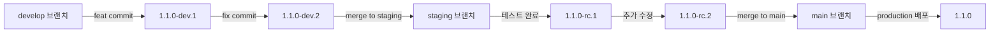
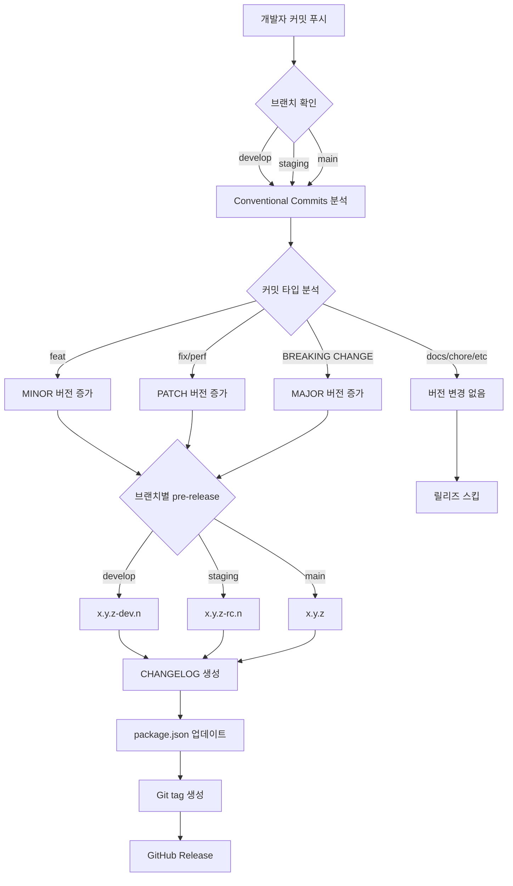

## 프로젝트 개요

웹앱의 배포 버전을 체계적으로 관리하기 위해 Semantic Versioning, Conventional Commits, semantic-release를 도입했습니다. 개발/스테이징/프로덕션 환경별 pre-release 전략을 수립하고, GitHub Actions를 통한 자동 버저닝 및 CHANGELOG 생성을 구현했습니다.

## 배경

### 문제 상황

- **배포 이력 추적 어려움**: 어떤 기능이 어느 버전에 배포되었는지 파악 곤란
- **환경별 버전 불일치**: dev/staging/production 환경의 버전 구분 없이 혼재
- **릴리즈 노트 부재**: 변경 사항을 수동으로 정리해야 하는 비효율

### 해결 목표

- Semantic Versioning 기반 자동 버전 관리
- Conventional Commits 규칙으로 커밋 메시지 표준화
  - Husky 에서 규칙 강제
- 환경별 pre-release 버전 자동 생성 (dev: `-dev.1`, staging: `-stg.1`)
- CHANGELOG.md 자동 생성 및 GitHub Release 자동 생성

## 기술 스택

- **Versioning**: [Semantic Versioning 2.0.0](https://semver.org/)
- **Commit Convention**: [Conventional Commits 1.0.0](https://www.conventionalcommits.org/ko/v1.0.0/)
- **Automation**: [semantic-release](https://github.com/semantic-release/semantic-release)
- **CI/CD**: GitHub Actions

## 주요 구현 내용

### 1. Semantic Versioning (SemVer)

버전 번호 `MAJOR.MINOR.PATCH` 규칙 정의

**버전 구성 요소**:
- **MAJOR**: 호환되지 않는 API 변경 (Breaking Changes)
- **MINOR**: 새로운 기능 추가
- **PATCH**: 버그 수정

**예시**:
```
1.0.0 → 1.0.1 (버그 수정)
1.0.1 → 1.1.0 (새 기능 추가)
1.1.0 → 2.0.0 (Breaking Change)
```

### 2. Conventional Commits 규칙 도입

커밋 메시지 표준화로 자동 버저닝 규칙 수립

**커밋 메시지 포맷**:
```
<type>(<scope>): <subject>

<body>

<footer>
```

**주요 타입과 버전 영향**:

| 타입 | 설명 | 버전 변경 |
|------|------|-----------|
| `feat` | 새로운 기능 추가 | MINOR ⬆️ |
| `fix` | 버그 수정 | PATCH ⬆️ |
| `perf` | 성능 개선 | PATCH ⬆️ |
| `BREAKING CHANGE` | 호환되지 않는 변경 | MAJOR ⬆️ |
| `docs`, `style`, `refactor`, `test`, `chore` | 버전 변경 없음 | - |

**커밋 예시**:
```bash
# MINOR 버전 증가 (1.0.0 → 1.1.0)
feat(iot): 실시간 IoT 디바이스 상태 동기화 기능 추가

# PATCH 버전 증가 (1.1.0 → 1.1.1)
fix(auth): 토큰 갱신 중 중복 요청 방지 로직 수정

# MAJOR 버전 증가 (1.1.1 → 2.0.0)
feat(api)!: 제품 카테고리 API 엔드포인트 변경

BREAKING CHANGE: /api/products 엔드포인트가 /api/v2/products로 변경됨
```

### 3. semantic-release 설정

`.releaserc.json` 설정으로 자동 버저닝 파이프라인 구축

**플러그인 역할**:
- **commit-analyzer**: 커밋 분석하여 버전 결정
- **release-notes-generator**: 릴리즈 노트 생성
- **changelog**: CHANGELOG.md 파일 생성
- **npm**: package.json 버전 업데이트 (npm 배포는 하지 않음)
- **git**: 변경사항 커밋 및 태그 생성
- **github**: GitHub Release 자동 발행

### 4. 환경별 pre-release 전략

개발/스테이징 환경에 pre-release 버전 자동 생성

**브랜치별 버전 전략**:



**버전 포맷**:
- **develop**: `1.1.0-dev.1`, `1.1.0-dev.2`, ... (개발 환경)
- **staging**: `1.1.0-rc.1`, `1.1.0-rc.2`, ... (QA 환경, release candidate)
- **main**: `1.1.0` (프로덕션 환경)

**`.releaserc.json` 브랜치 설정**:
```json
{
  "branches": [
    "main",
    {
      "name": "staging",
      "prerelease": "rc"
    },
    {
      "name": "develop",
      "prerelease": "dev"
    }
  ]
}
```

### 5. GitHub Actions 자동화 워크플로우

커밋 푸시 시 자동 버저닝 및 릴리즈

**워크플로우 동작**:
1. main/staging/develop 브랜치에 푸시 감지
2. Conventional Commits 분석하여 버전 결정
3. CHANGELOG.md 자동 생성
4. package.json 버전 업데이트
5. Git tag 생성 및 푸시
6. GitHub Release

### 6. 자동 버저닝 플로우 시각화



### 7. CHANGELOG 자동 생성 예시

semantic-release가 자동 생성한 CHANGELOG.md 예시:

```markdown
# Changelog

## [1.2.0](https://github.com/company/iocare-plus/compare/v1.1.0...v1.2.0) (2024-04-15)

### ✨ 새로운 기능

- **iot**: 아이콘 프로 제품 개발 ([a1b2c3d](https://github.com/company/iocare-plus/commit/a1b2c3d))
- **bottomsheet**: 바텀시트 컴포넌트 구현 ([e4f5g6h](https://github.com/company/iocare-plus/commit/e4f5g6h))

### 🐛 버그 수정

- **auth**: 토큰 갱신 로직 수정 ([i7j8k9l](https://github.com/company/iocare-plus/commit/i7j8k9l))
- **network**: 네트워크 끊김 토스트 구현 ([m0n1o2p](https://github.com/company/iocare-plus/commit/m0n1o2p))

## [1.1.0](https://github.com/company/iocare-plus/compare/v1.0.0...v1.1.0) (2024-03-20)

### ✨ 새로운 기능

- **i18n**: 미국 법인 다국어 추가 ([u6v7w8x](https://github.com/company/iocare-plus/commit/u6v7w8x))
```
