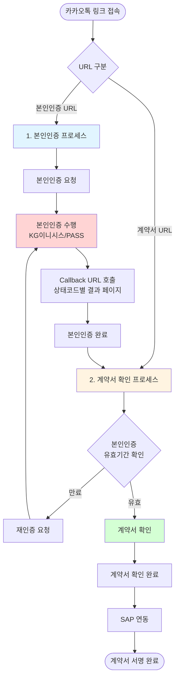
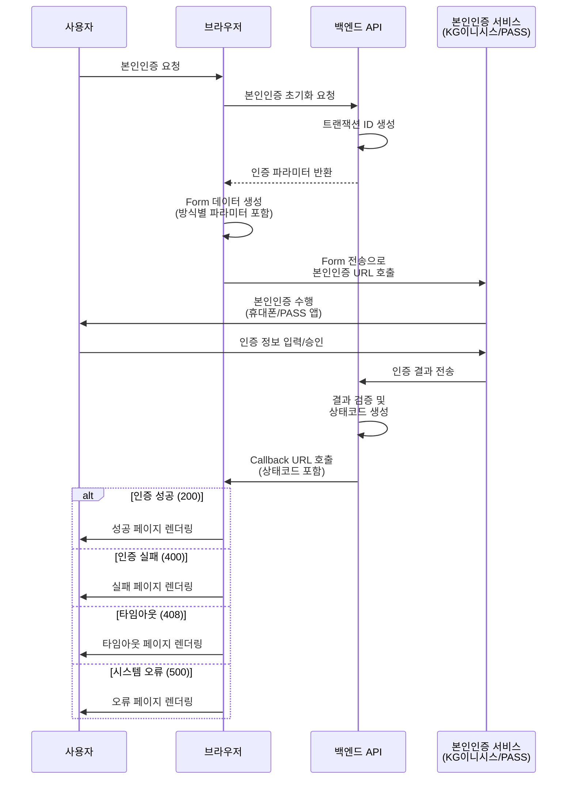

## 프로젝트 개요

코웨이 제품을 주문서에 대한 본인인증을 수행할 수 있는 서비스입니다. KG이니시스와 PASS 본인인증 API를 연동하여 안전한 본인확인 프로세스를 제공하며, 카카오톡 공유 시 동적 메타태그를 제공하여 사용자 경험을 개선했습니다.

**서비스 URL**: [코웨이패스](https://pass.coway.com) (주문번호 검증으로 서비스 확인 불가)

## 기술 스택

- **Frontend**: React, TypeScript
- **Build Tool**: Vite
- **Routing**: React Router
- **Authentication**: KG이니시스, PASS 본인인증 API
- **Infrastructure**: AWS Lambda, CloudFront
- **Optimization**: 반응형 웹 디자인, 웹 접근성, 카카오톡 인앱 브라우저 최적화

## 프로젝트 정보

- **역할**: 업무 PL (Project Leader)
- **담당**: 프론트엔드 설계, 개발, 인프라 구축

## 서비스 화면 플로우

코웨이패스는 크게 2가지 프로세스로 구성되어 있으며, 각 프로세스는 URL이 구분되어 있어 OpenGraph 메타태그를 다르게 제공합니다.

**프로세스 설명**:

1. **본인인증 프로세스**:
   - URL: `/auth` 또는 `/certification`
   - 본인인증 요청 → KG이니시스/PASS 인증 → Callback URL → 결과 페이지

2. **계약서 확인 프로세스**:
   - URL: `/contract` 또는 `/agreement`
   - 본인인증 유효기간 체크 → (만료 시 재인증) → 계약서 확인 → SAP 연동

## 주요 과제

### 1. 외부 본인인증 API 연동

백엔드 개발자와 협업하여 KG이니시스와 PASS 본인인증 서비스를 연동했습니다. Form 전송 방식으로 외부 본인인증 URL에 연동하고, 본인인증 방식에 따라 API body에 필요한 파라미터를 포함하도록 구현했습니다.

본인인증 결과는 백엔드와 협의한 상태코드를 기반으로 callback URL 호출 시 처리되며, 상태코드에 맞는 결과 페이지를 선언적 컴포넌트로 구현하여 유지보수성을 높였습니다.

#### 본인인증 처리 플로우

#### 상태코드별 선언적 컴포넌트 구현

백엔드와 협의한 상태코드를 기반으로 결과 페이지를 선언적으로 구현했습니다.

각 상태에 맞는 컴포넌트를 분리하여 구현함으로써 코드의 가독성과 유지보수성을 향상시켰습니다.

### 3. AWS Lambda 기반 동적 OpenGraph 서비스

코웨이패스는 본인인증과 계약서 확인 두 가지 프로세스로 구성되어 있으며, 각 프로세스는 URL로 구분됩니다. Lambda@Edge를 활용하여 URL에 따라 서로 다른 OpenGraph 메타태그를 동적으로 생성하여, 카카오톡 공유 시 프로세스별 적절한 미리보기를 표시했습니다.

#### URL별 메타태그 분기 처리

아래 url 에 따라 타이틀, 디스크립션, 이미지를 다르게 처리합니다.

- 본인인증 URL (`/auth`):
- 계약서 확인 URL (`/contract`):

### 4. 카카오톡 인앱 브라우저 최적화

카카오톡 인앱 브라우저 환경에서 발생하는 다양한 이슈를 해결하고 최적화했습니다.

#### 뒤로가기 이벤트 감지 및 제어

본인인증 및 계약서 확인 프로세스에서 사용자가 뒤로가기 버튼을 통해 중요한 단계를 건너뛰는 것을 방지하기 위해 `popstate` 이벤트를 활용한 뒤로가기 제어 기능을 구현했습니다.

**구현 방법**:
- `history.pushState()`로 가상의 히스토리 엔트리 추가
- `popstate` 이벤트 리스너로 뒤로가기 감지
- 중요 단계(본인인증 진행 중, 계약서 작성 중)에서 뒤로가기 방지

### 5. Vite 기반 빌드 최적화

Vite를 활용하여 빠른 개발 환경과 최적화된 프로덕션 빌드를 구성했습니다.

#### 번들 최적화

코드 스플리팅과 트리 쉐이킹을 통해 번들 크기를 최소화했습니다:
- 라우트별 코드 스플리팅 (React.lazy)
- 외부 라이브러리 Chunk 분리
- 사용하지 않는 코드 제거 (Tree-shaking)
- CSS 최적화 및 압축
