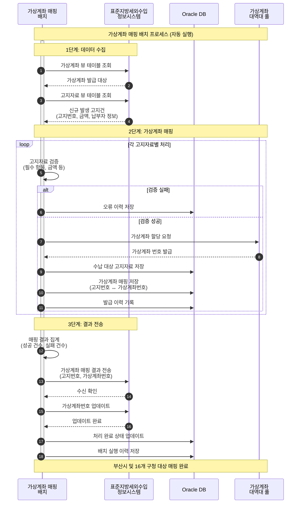
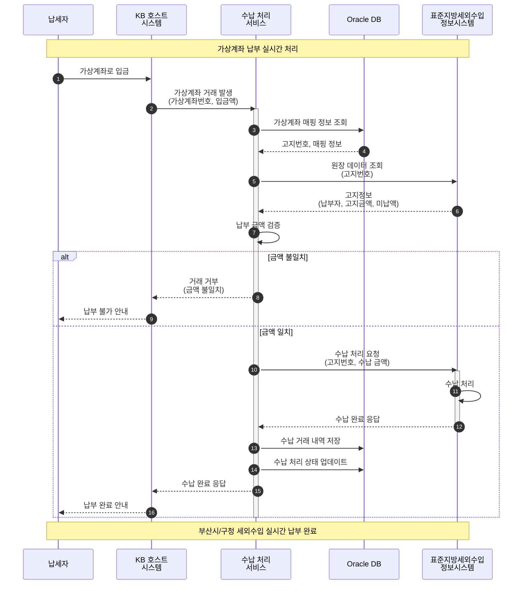
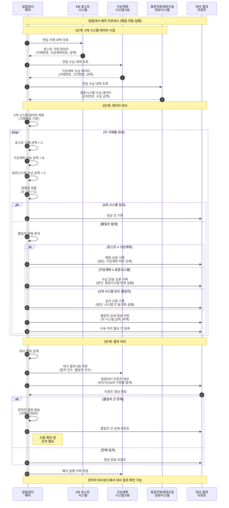

## 프로젝트 개요

표준지방세외수입정보시스템에서 생성되는 납세자의 고지정보를 KB국민은행 가상계좌팀에서 발급받은 가상계좌 대역대를 이용하여 납부 가능한 가상계좌번호로 매핑하여, 납세자가 수납할 수 있도록 서비스를 제공하는 시스템입니다. 부산시 및 16개 구청을 대상으로 하는 범용 가상계좌 시스템을 구축했습니다.

## 프로젝트 정보

- **고객사**: KB국민은행, 부산시청 및 16개 구청
- **포지션**: Back-end
- **개발 인원**: 2명

## 기술 스택

- **Backend**: Java, Spring Framework
- **Database**: Oracle
- **Scripting**: Shell Script
- **OS**: Linux, Windows 10

## 업무 프로세스

부산시 및 총 16개 구청에 대한 범용 가상계좌 시스템을 구축하여, 세 가지 핵심 프로세스를 자동화했습니다.

### 1. **가상계좌 매핑 (배치 프로세스)**

표준지방세외수입정보시스템과 연동하여 고지자료에 가상계좌를 자동으로 매핑하는 배치 프로세스입니다.

**프로세스 플로우**:

1. **표준지방세외수입정보시스템 데이터 조회**
   - 가상계좌 뷰 테이블 조회
   - 고지자료 뷰 테이블 조회
   - 신규 발생 고지건 확인

2. **내부 테이블 적재**
   - 수납 대상 고지자료 저장
   - 고지자료별 가상계좌 매핑 처리
   - 가상계좌 대역대 관리 및 할당
   - 중복 검증 및 에러 처리

3. **표준지방세외수입정보시스템 결과 적재**
   - 매핑 결과 전송
   - 가상계좌번호 업데이트
   - 처리 이력 기록

### 2. **가상계좌 납부 (실시간 서비스)**

납세자가 가상계좌로 납부 시 실시간으로 처리하는 서비스입니다.

**프로세스 플로우**:

1. **가상계좌 거래 발생**
   - KB국민은행 호스트 시스템에서 거래 발생
   - 가상계좌번호로 거래 정보 수신

2. **표준지방세외수입정보시스템 원장 데이터 조회**
   - 가상계좌번호로 고지정보 조회
   - 납부 금액 검증
   - 수납 가능 여부 확인

3. **수납 자료 전송**
   - 표준지방세외수입정보시스템으로 수납 처리 요청
   - 수납 완료 처리
   - 거래 결과 응답

### 3. **일일대사 (배치 프로세스)**

각 시스템 간의 수납 자료를 동기화하여 데이터 정합성을 보장합니다.

**프로세스 플로우**:

1. **호스트 시스템 수납 자료 조회**
   - KB국민은행 호스트에서 당일 거래 내역 수집

2. **가상계좌 시스템 수납 자료 조회**
   - 내부 시스템의 수납 처리 내역 조회

3. **표준지방세외수입정보시스템 수납 자료 조회**
   - 지방세 시스템의 수납 완료 내역 조회

4. **3개 시스템 데이터 대사**
   - 거래 건수 및 금액 비교
   - 불일치 건 확인 및 리포트 생성
   - 오류 건에 대한 재처리 또는 수동 처리 안내

## 담당 업무

### 1. **업무 테이블 설계/구현**

가상계좌 시스템에 필요한 데이터베이스 스키마를 설계하고 구현했습니다.

- **가상계좌 관리 테이블**
  - 가상계좌 대역대 관리 테이블
  - 가상계좌 매핑 테이블 (고지번호 ↔ 가상계좌번호)
  - 가상계좌 발급 이력 테이블

- **고지자료 관리 테이블**
  - 수납 대상 고지자료 테이블
  - 고지자료 상태 관리 (발급, 수납, 취소 등)
  - 고지자료 변경 이력 테이블

- **수납 처리 테이블**
  - 수납 거래 내역 테이블
  - 수납 처리 상태 관리 테이블
  - 수납 오류 이력 테이블

- **대사 관리 테이블**
  - 일일대사 결과 테이블
  - 대사 불일치 내역 테이블
  - 대사 처리 이력 테이블

- **인덱스 및 성능 최적화**
  - 주요 조회 컬럼에 대한 인덱스 설계
  - 파티셔닝 전략 수립 (일자별)
  - 쿼리 성능 튜닝

### 2. **시스템 구성도 설계 및 구현**

3개의 시스템(호스트, 가상계좌, 표준지방세외수입정보)이 연동되는 전체 아키텍처를 설계 그리고 은행/지자체 서버 설치 작업 및 커뮤니케이션을 수행했습니다.

- **시스템 간 연동 구조**
  - KB국민은행 호스트 시스템 ↔ 가상계좌 시스템
  - 가상계좌 시스템 ↔ 표준지방세외수입정보시스템
  - 배치 서버, 서비스 서버, DB 서버 구성

- **네트워크 구성**
  - DMZ 영역 배치
  - 방화벽 정책 수립
  - 전용선 연결 구성

- **HA(High Availability) 구성**
  - 이중화 서버 구성

### 3. **업무 배치/서비스 설계/구현**

핵심 업무 로직을 배치 프로그램과 실시간 서비스로 구현했습니다.

#### **가상계좌 매핑 배치**
- Spring Batch 프레임워크 활용
- 대용량 고지자료 처리 (Chunk 단위 처리)
- 가상계좌 대역대 관리 및 자동 할당 로직
- 중복 매핑 검증 및 에러 핸들링

#### **고지자료 등록 배치**
- 표준지방세외수입정보시스템 뷰 테이블 조회
- 신규/변경/취소 고지자료 구분 처리
- 데이터 정합성 검증
- 적재 완료 후 결과 전송

#### **수취인 조회 서비스**
- 가상계좌번호로 고지정보 실시간 조회

#### **수납 처리 서비스**
- 실시간 수납 처리 트랜잭션 관리
- 표준지방세외수입정보시스템 연동
- 수납 완료 응답 처리
- 오류 발생 시 롤백 및 재처리

#### **일일 대사 배치**
- 3개 시스템 데이터 자동 대사
- 불일치 건 추출 및 분석
- 대사 결과 리포트 생성

### 4. **시스템간 전문 통신 서비스 설계/구현**

각 시스템 간의 전문 통신 인터페이스를 구현했습니다.

- **전문 포맷 정의**
  - 고정 길이 전문 포맷 설계
  - 헤더/바디 구조 정의
  - 전문 코드 및 에러 코드 체계 수립

- **전문 송수신 처리**
  - Socket 통신 구현
  - 전문 파싱 및 생성 유틸리티
  - 타임아웃 및 재전송 로직
  - 전문 이력 관리

- **에러 핸들링**
  - 통신 오류 처리
  - 비즈니스 오류 처리
  - 에러 로그 기록 및 알림

### 5. **관리자 어드민 대시보드 설계/구현**

운영자를 위한 관리 화면을 구현했습니다.

- **모니터링 대시보드**
  - 실시간 거래 현황 모니터링
  - 배치 작업 진행 상황 확인

- **업무 관리 기능**
  - 가상계좌 대역대 관리
  - 고지자료 조회 및 수정
  - 수납 내역 조회 및 취소
  - 대사 결과 조회 및 처리

- **통계 및 리포트**
  - 일/월/년 거래 통계
  - 구청별 수납 현황
  - 배치 처리 이력 조회

### 6. **빌드/배포 Shell Script 설계/구현**

빌드 및 배포 스크립트를 개발했습니다.

- **빌드 스크립트**
  - Maven 기반 빌드 자동화
  - 환경별 설정 파일 관리 (dev, staging, production)
  - 배포 패키지 생성 (war, jar)

- **배포 스크립트**
  - 서버별 자동 배포
  - 서비스 중지 → 배포 → 서비스 시작 프로세스
  - 롤백 스크립트

- **운영 스크립트**
  - 애플리케이션 시작/중지 스크립트

## 개발 구현 내용

### Backend 개발

1. **Spring Framework**
   - Spring MVC 패턴
   - Spring Batch 배치 프레임워크
   - 트랜잭션 관리

2. **가상계좌 매핑 시스템**
   - 가상계좌 대역대 관리 서비스
   - 고지번호 ↔ 가상계좌 매핑 로직
   - 중복 검증 및 에러 처리

3. **수납 처리 시스템**
   - 실시간 수납 처리 서비스
   - 표준지방세외수입정보시스템 연동
   - 거래 이력 관리

4. **대사 시스템**
   - 3개 시스템 데이터 대사 로직
   - 불일치 건 추출 및 처리
   - 리포트 생성

### Database 개발

5. **Oracle DB**
   - 가상계좌, 고지자료, 수납, 대사 테이블 설계
   - 프로시저 및 함수 구현

### 시스템 통합

6. **전문 통신 인터페이스**
   - 전문 통신
   - 전문 파싱/생성 유틸리티
   - 타임아웃 및 재전송 처리

7. **외부 시스템 연동**
   - KB국민은행 호스트 시스템 연동
   - 표준지방세외수입정보시스템 연동
   - 데이터 동기화 및 정합성 관리

### 자동화 및 운영

8. **Shell Script 자동화**
   - 빌드/배포 자동화 스크립트
   - 애플리케이션 관리 스크립트
   - 로그 관리 및 모니터링 스크립트

9. **배치 스케줄링**
   - Cron 기반 배치 스케줄 설정
   - 배치 작업 모니터링 및 알림
   - 오류 발생 시 재처리 로직
