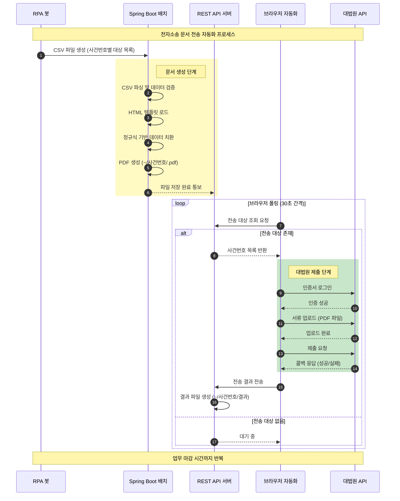

## 프로젝트 개요

대법원이 제공하는 전자소송 문서 API를 이용하여, KB국민은행이 제공하는 데이터를 가공하여 사건번호별 첨부파일을 생성하고 전송하는 자동화 시스템을 구축했습니다. RPA 봇, Spring Boot 배치, 브라우저 자동화가 유기적으로 연동되어 사람의 개입 없이 전자소송 서류 제출이 완전히 자동화되었습니다.

## 프로젝트 정보

- **고객사**: KB국민은행
- **포지션**: Front/Back-end
- **개발 인원**: 1명

## 기술 스택

- **Frontend**: ES6, HTML5, CSS
- **Backend**: Spring Boot, REST API
- **Tools**: 정규식, Direct Buffer
- **Integration**: 대법원 전자소송 API, RPA 연동(File-to-File)

## 업무 프로세스

전자소송 문서 전송은 다음과 같은 완전 자동화 프로세스로 진행됩니다.

### 1. **사건번호별 대상 목록 생성 (RPA 봇)**

KB국민은행 RPA(봇)가 전자소송 대상 사건 목록을 자동으로 생성합니다.

**프로세스 플로우**:

1. **사건 데이터 수집**
   - KB국민은행 내부 시스템에서 전자소송 대상 사건 조회
   - 사건번호, 당사자 정보, 서류 유형 등 수집

2. **CSV 파일 생성**
   - 사건번호별 대상 목록 `.csv` 파일 자동 생성
   - 대상 사건정보, 첨부 서류 정보 포함
   - 지정된 경로에 파일 저장

### 2. **CSV 파싱 및 문서 생성 (Spring Boot 배치)**

Spring Boot 배치 프로그램이 `.csv` 파일을 파싱하여 사건별 PDF 문서를 자동 생성합니다.

**프로세스 플로우**:

1. **CSV 파일 파싱**
   - Direct Buffer를 활용한 대용량 `.csv` 파일 고속 처리
   - 사건번호, 서류 유형, 데이터 필드 추출
   - 데이터 유효성 검증

2. **HTML → PDF 변환**
   - 업무별 사전 준비된 `.html` 템플릿 로드
   - 정규식을 활용한 동적 데이터 치환
     - 사건번호, 당사자명, 날짜, 금액 등 필드별 정규식 매칭
     - 템플릿 변수를 실제 데이터로 자동 치환
   - 변환된 HTML을 PDF로 생성
   - `~/사건번호/.pdf`, `.OK` 결과 파일 생성

### 3. **브라우저 자동화 준비 (REST API 서버)**

Spring Boot 와 브라우저와 통신하기 위한 REST API 설계/구현.

**프로세스 플로우**:

1. **전송 대상 조회 API**
   - 브라우저가 특정 시간마다 폴링하여 전송 가능한 사건번호 확인
   - 전송 대기 중인 사건 목록 JSON 형식으로 반환
   - 사건별 첨부 파일 경로 정보 제공

2. **작업 진행 상태 API**
   - 전송 대상이 존재하면 작업 페이지로 자동 이동
   - 사건번호별 서류 자동 세팅
   - 첨부 파일 경로 정보 전달

### 4. **대법원 API 호출 및 서류 제출 (브라우저 자동화)**

브라우저에서 대법원 전자소송 API를 호출하여 인증 및 서류를 제출합니다.

**프로세스 플로우**:

1. **인증 프로세스**
   - 대법원 API 인증서 로그인 자동 처리
   - 세션 유지 및 관리
   - 보안 토큰 처리

2. **서류 제출**
   - 사건번호별 서류 자동 업로드
   - 첨부 파일 전송
   - 제출 완료 확인

3. **결과 콜백 처리**
   - 대법원 API 콜백 함수로 사건번호별 정상/오류 상태 수신
   - 응답 데이터를 서버로 전송
   - `~/사건번호/` 경로에 전송 결과 파일 생성
   - 성공/실패 로그 기록

### 5. **반복 처리**

- 업무 마감 시간까지 위 1~4 프로세스를 자동 반복
- **모든 프로세스는 사람 개입 없이 스크립트, 배치를 통한 완전 자동화**
- 에러 발생 시 재시도 로직 자동 적용

## 담당 업무

### 1. **화면 레이아웃 및 디자인 구성**

전자소송 문서 전송을 위한 브라우저 인터페이스를 개발했습니다.

#### **Flexbox 기반 반응형 레이아웃**

- **작업 진행 상태 UI**
  - 사건번호별 전송 진행 상태 표시
  - 대기, 진행 중, 완료, 실패 상태별 시각화
  - 진행률 표시 (Progress Bar)

- **사건번호별 서류 목록 화면**
  - 전송 대상 사건 목록 Grid
  - 첨부 파일 미리보기
  - 전송 상태 필터링 기능

#### **HTML5, CSS 디자인**

- **실시간 상태 피드백**
  - 전송 진행 중 애니메이션 효과
  - 성공/실패 상태별 색상 구분
  - Toast 알림 메시지 UI

### 2. **Frontend ES6 기능 구현**

브라우저 자동화 및 API 연동을 위한 프론트엔드 로직 설계/구현

#### **자동 폴링 시스템**

- **주기적 서버 통신**
  - 특정 시간 간격으로 서버 API 호출하여 전송 대상 확인
  - ES6 Async/Await 패턴 활용
  - Promise 기반 비동기 처리

#### **대법원 API 연동**

- **인증서 로그인 자동화**
  - 인증서 선택 및 비밀번호 입력 자동 처리
  - 로그인 세션 유지 관리

- **서류 업로드 처리**
  - FormData를 활용한 파일 업로드
  - 다중 파일 동시 전송
  - 업로드 진행률

- **콜백 함수 처리 및 결과 전송**
  - 대법원 API 콜백 함수 구현
  - 전송 결과를 서버로 POST 요청
  - 에러 처리 및 재시도 로직

#### **자동 작업 처리**

- **사건번호별 서류 자동 세팅**
  - 사건 정보 자동 입력
  - 서류 유형 자동 선택
  - 첨부 파일 자동 세팅

### 3. **Spring Boot REST API 및 Batch 개발**

백엔드 로직 설계/구현

#### **REST API 개발**

**1) 전송 대상 조회 API**

- 전송 가능한 사건번호 목록 반환
- 사건별 첨부 파일 정보 제공
- JSON 형식 응답

**2) 전송 결과 수신 API**

- 대법원 API 콜백 결과 수신
- 성공/실패 상태 DB 저장
- 결과 파일 생성

#### **Batch 프로그램 개발**

**1) CSV 파싱 배치**

- **Direct Buffer**
  - 대용량 데이터 처리

**2) PDF 생성 배치**

- HTML 템플릿 기반 PDF 자동 생성
- 사건번호별 디렉토리 관리
- 배치 처리 스케줄링
- 생성 결과 로그 기록

### 4. **템플릿 HTML 정규식 활용**

유지보수를 용이하게 하기 위한 템플릿 시스템을 구축했습니다.

#### **업무별 HTML 템플릿 설계**

- **서류 유형별 템플릿 분리**
  - 서류 유형별 템플릿
  - 재사용 가능한 공통 템플릿 구조

#### **정규식 기반 데이터 치환**

- **템플릿 변수 패턴 정의**
  - 변수 형식: `{{사건번호}}`, `{{당사자명}}`

- **특수문자 이스케이프 처리**
  - HTML 특수문자 자동 변환
  - 정규식 메타문자 이스케이프

- **포맷 자동 변환**
  - 날짜 포맷 변환 (예: 20200215 → 2020년 2월 15일)

### 5. **협업 및 연동**

RPA 개발자와 협업하여 CSV 파일 포맷 및 저장 경로를 정의하고, 대법원 API 개발자와 협업하여 API 명세서 및 인증 프로세스를 협의했습니다.

#### **RPA(봇) 개발자와의 협업**

- **CSV 파일 포맷 규격 정의**
  - 필수 컬럼, 데이터 타입 정의
  - 구분자, 인코딩 표준 협의

- **파일 저장 경로 및 네이밍 규칙 협의**
  - 파일명 패턴 정의
  - 디렉토리 구조 설계

- **에러 처리 프로토콜 정의**
  - 오류 발생 시 재시도 정책
  - 에러 로그 포맷 통일

#### **대법원 API 개발자와의 협업**

- **API 명세서 검토 및 피드백**
  - API 엔드포인트, 파라미터 검토
  - 응답 형식 협의

- **인증 프로세스 협의**
  - 인증서 로그인 플로우 협의
  - 세션 유지 방법 정의

- **라이브러리 사용 협의**
  - ifamerame 내 API 호출 제한 사항 검토
  - postmessage 활용 방안 협의

## 개발 구현 내용

### Frontend 개발

1. **ES6 브라우저 자동화**
   - Async/Await 패턴
   - Fetch API 활용
   - 자동 폴링 시스템
   - 대법원 API 연동
   - 콜백 함수 처리

2. **UI 구현**
   - Flexbox 레이아웃
   - 반응형 디자인
   - 실시간 상태 표시
   - 진행률 표시
   - Toast 알림

### Backend 개발

3. **Spring Boot REST API**
   - RESTful 엔드포인트 설계
   - JSON 응답 처리
   - 에러 핸들링
   - CORS 설정

4. **Batch 프로그램**
   - CSV 파싱 배치
   - PDF 생성 배치
   - Spring Scheduler 활용
   - 배치 모니터링

5. **파일 처리 최적화**
   - Direct Buffer 활용
   - 스트림 기반 처리
   - 메모리 관리
   - 성능 모니터링

6. **템플릿 시스템**
   - HTML 템플릿 엔진
   - 정규식 기반 치환
   - 포맷 변환 유틸리티
   - 템플릿 검증

### 시스템 통합

7. **외부 연동**
   - RPA 시스템 연동
   - 대법원 전자소송 API 연동
   - 인증서 기반 인증
   - 파일 시스템 연동

8. **자동화 시스템**
   - 전체 프로세스 무인 자동화
   - 에러 처리 및 재시도
   - 결과 로깅 및 모니터링
