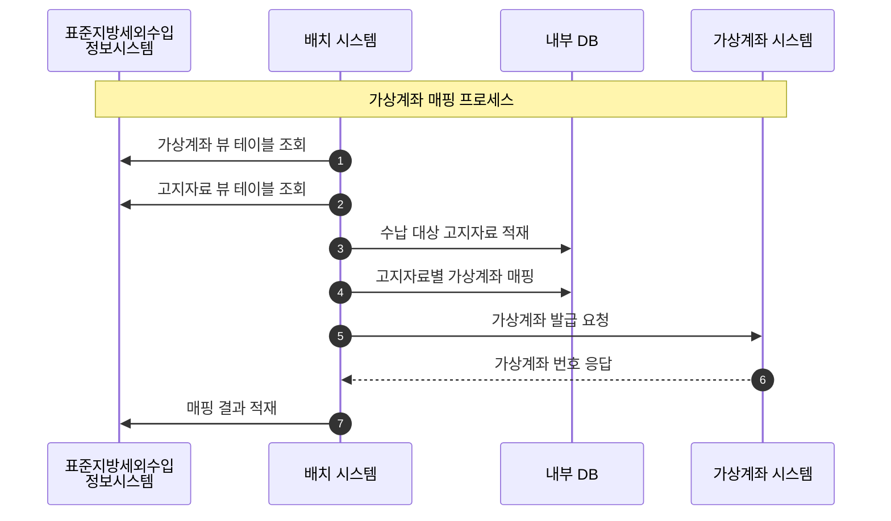
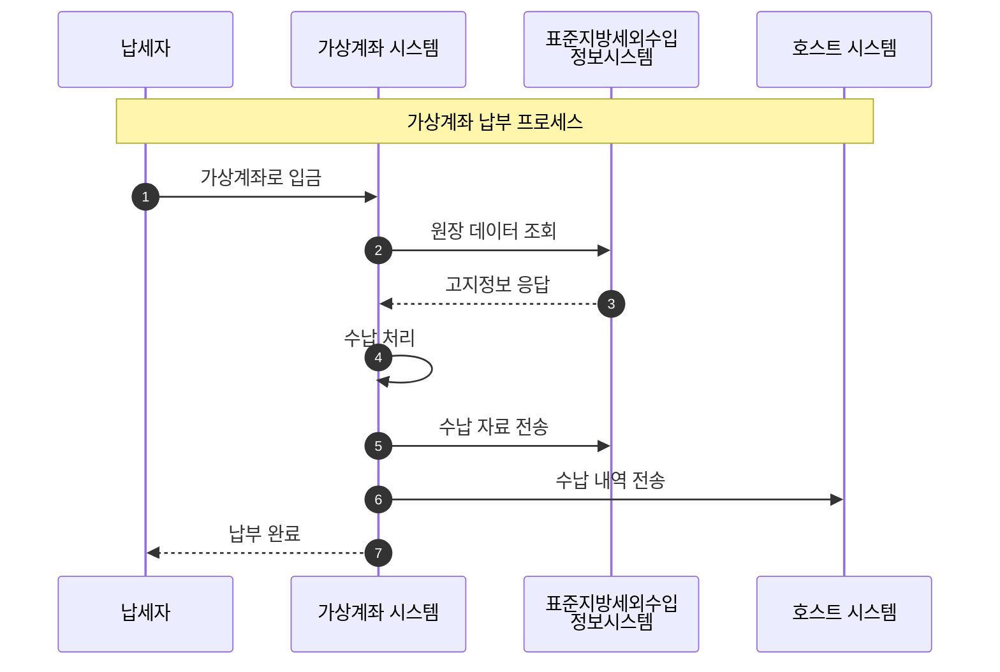
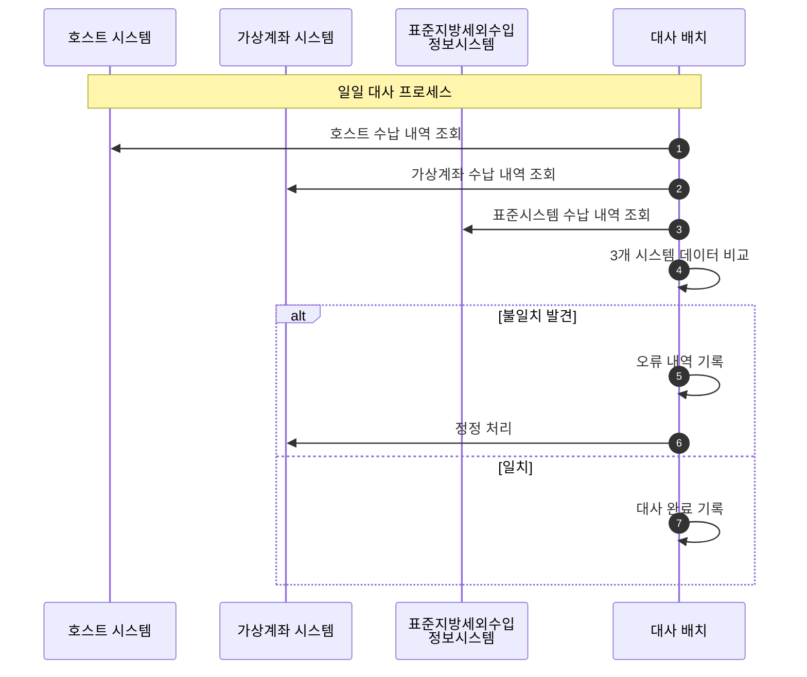

## 프로젝트 개요

표준지방세외수입정보시스템에서 생성되는 납세자의 고지정보를 KB국민은행 가상계좌팀에서 발급받은 가상계좌 대역대를 이용하여 납부 가능한 가상계좌번호를 매핑하여 납세자가 수납할 수 있도록 서비스를 제공합니다.

**경기도청 소방특별회계에 대한 범용 가상계좌 시스템을 구축했습니다.**

## 기술 스택

- **Language**: Java, JavaScript
- **Framework**: Spring Framework
- **Database**: Oracle
- **DevOps**: Shell Script, Linux
- **OS**: Linux, Windows

## 프로젝트 정보

- **고객사**: KB국민은행, 경기도청
- **개발 인원**: 1명
- **담당 역할**: Back-end, Front-end(My Start 단말), 인프라

## 업무 프로세스

### 1. 가상계좌 매핑 (배치)

1. 표준지방세외수입정보시스템 가상계좌 뷰 테이블, 고지자료 뷰 테이블 조회
2. 내부 테이블 적재
   - 수납 대상 고지자료
   - 고지자료별 가상계좌 매핑
3. 표준지방세외수입정보시스템 결과 적재

### 2. 가상계좌 납부 (서비스)

1. 가상계좌 거래 시 표준지방세외수입정보시스템에 대한 원장 데이터 조회
2. 수납 자료 전송

### 3. 일일 대사

호스트 시스템, 가상계좌 시스템, 표준지방세외수입정보시스템의 수납 자료 동기화

## 담당 업무

### 1. 업무 테이블 설계/구현
- 고지자료 테이블 설계
- 가상계좌 매핑 테이블 설계
- 수납 내역 테이블 설계
- 대사 결과 테이블 설계

### 2. 시스템 구성도 설계 및 구현
- 시스템 아키텍처 설계
- 표준지방세외수입정보시스템 연동 구조 설계
- 가상계좌 시스템 연동 구조 설계

### 3. 업무 배치/서비스 설계/구현
- **가상계좌 매핑, 고지자료 등록**
  - 고지자료 수집 배치 개발
  - 가상계좌 매핑 로직 구현
- **수취인 조회, 수납 처리**
  - 수취인 조회 서비스 개발
  - 실시간 수납 처리 서비스 구현
- **일일 대사**
  - 3개 시스템 간 수납 내역 대사 배치 개발
  - 오류 감지 및 정정 프로세스 구현

### 4. 시스템 간 전문 통신 서비스 설계/구현
- 표준지방세외수입정보시스템 전문 통신 개발
- 가상계좌 시스템 전문 통신 개발
- 호스트 시스템 전문 통신 개발
- 전문 송수신 로그 관리 시스템 구현

### 5. 빌드/배포 Shell Script 설계/구현
- 자동 빌드 스크립트 작성
- 배포 자동화 스크립트 구현
- 서버 환경별 배포 스크립트 구성
- 롤백 스크립트 구현
