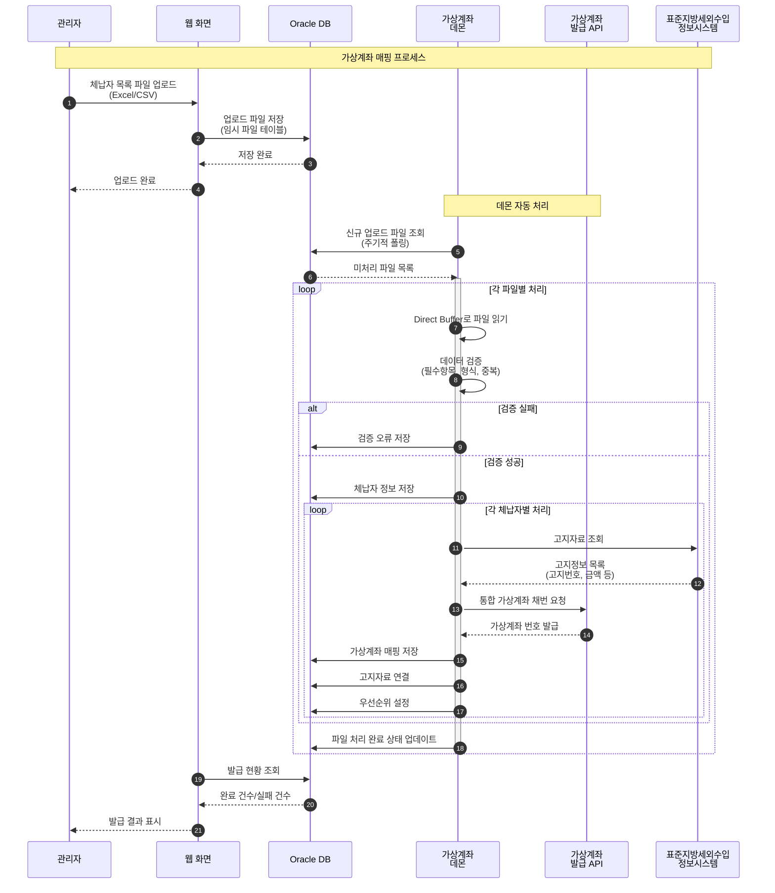
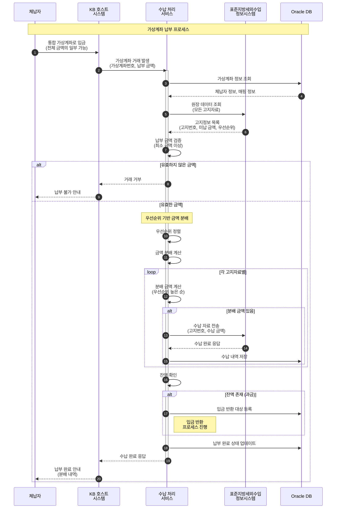
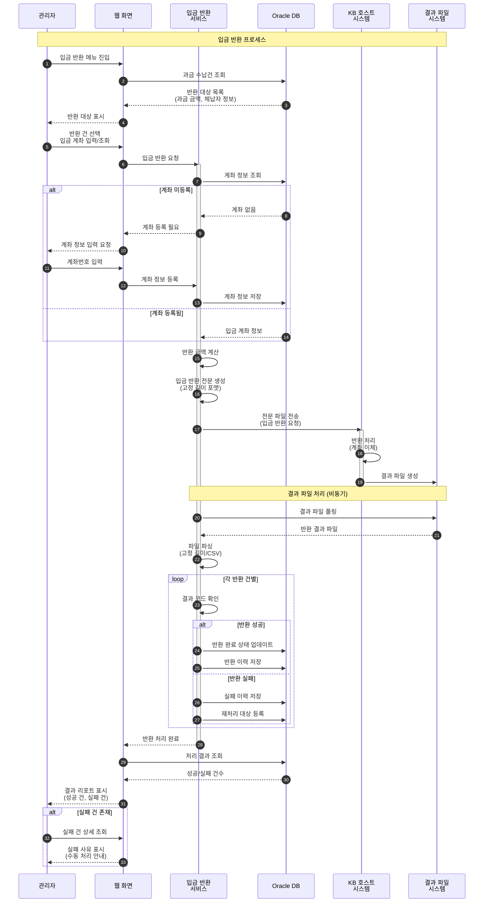
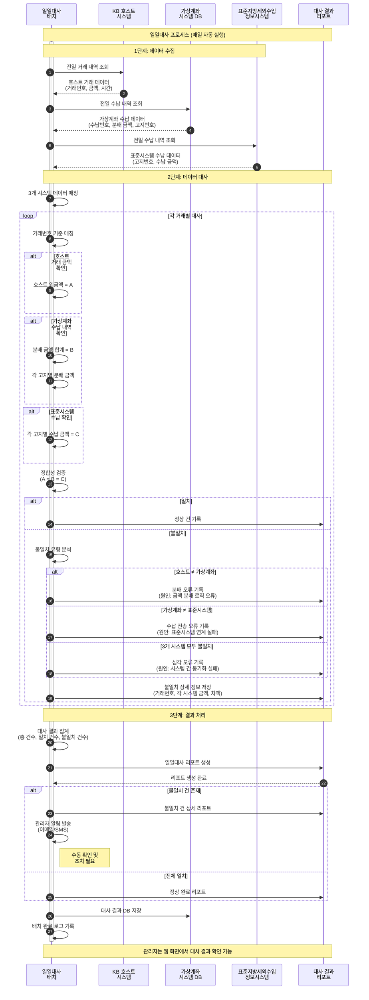

## 프로젝트 개요

관리자 대시보드 및 가상계좌 데몬을 구현하여 표준지방세를 납부하지 않은 단건/대량 체납자 정보를 엑셀 업로드하면 가상계좌 데몬이 이를 인지하고 가상계좌를 채번/발급합니다.

체납자는 1건 이상의 고지자료를 발급받은 **하나의 가상계좌 번호**를 통해 체납 금액에 구애받지 않고 수납 처리를 할 수 있게 됩니다. 수납된 정보는 관리자 대시보드에서 확인 가능하며, 관리자는 고지자료의 우선순위 또는 금액에 따라 납부 처리를 하여 업무의 효율성을 높일 수 있도록 시스템을 구축했습니다.

## 프로젝트 정보

- **고객사**: KB국민은행, 지방자치단체
- **포지션**: Front/Back-end
- **개발 인원**: 5명

## 기술 스택

- **Frontend**: JavaScript, jQuery
- **Backend**: Java, Spring Framework
- **Database**: Oracle
- **Server**: Linux, Windows

## 핵심 특징

### **유동성 가상계좌의 차별점**

기존 가상계좌 시스템과 달리, 유동성 가상계좌는 다음과 같은 특징을 가집니다:

- **통합 가상계좌**: 1개의 가상계좌 번호로 여러 건의 고지자료 납부 가능
- **유동적 금액 납부**: 체납 금액에 구애받지 않고 원하는 금액만큼 납부 가능
- **우선순위 관리**: 관리자가 고지자료의 납부 우선순위를 설정
- **과금 자동 분배**: 납부 금액을 우선순위/금액에 따라 자동으로 각 고지자료에 분배

## 업무 프로세스

### 1. **가상계좌 매핑 (웹 화면)**

체납자 정보를 대량으로 업로드하여 통합 가상계좌를 발급하는 프로세스입니다.

**프로세스 플로우**:

1. **체납자 목록 업로드**
   - `.excel` 또는 `.csv` 형태의 파일 업로드
   - 체납자 정보 검증 (필수 항목, 형식 등)
   - 중복 체크

2. **통합 가상계좌 채번**
   - 가상계좌 데몬이 업로드된 파일 감지
   - 체납자별 통합 가상계좌 번호 자동 채번
   - 가상계좌 발급 및 매핑 처리

3. **고지자료 연결**
   - 체납자의 모든 고지자료를 하나의 가상계좌에 연결
   - 납부 우선순위 설정
   - 발급 완료 알림

### 2. **가상계좌 납부 (실시간 서비스)**

체납자가 통합 가상계좌로 납부 시 처리하는 서비스입니다.

**프로세스 플로우**:

1. **가상계좌 거래 발생**
   - KB국민은행 호스트 시스템에서 거래 발생
   - 납부 금액 확인 (전체 체납액보다 적은 금액도 가능)

2. **표준지방세외수입정보시스템 원장 데이터 조회**
   - 가상계좌번호로 연결된 모든 고지정보 조회
   - 각 고지자료의 미납 금액 확인

3. **수납 자료 전송**
   - 우선순위에 따라 납부 금액 자동 분배
   - 각 고지자료별 수납 처리
   - 표준지방세외수입정보시스템으로 수납 완료 전송

### 3. **입금 반환 (웹/서비스)**

수납 시 과금된 금액을 반환하는 프로세스입니다.

**프로세스 플로우**:

1. **과금 수납건 선별**
   - 수납 금액이 고지 금액을 초과한 건 조회
   - 반환 대상 금액 계산
   - 반환 대상 목록 생성

2. **입금 계좌번호 조회/등록**
   - 체납자의 입금 계좌 정보 조회
   - 미등록 시 계좌 정보 등록 화면 제공
   - 계좌 유효성 검증

3. **입금 반환 처리**
   - 입금 반환 서비스 호출
   - 호스트 시스템과 연계하여 반환 처리
   - 반환 완료 결과 DB 저장 및 알림

### 4. **일일대사**

각 시스템 간의 수납 자료를 동기화하여 데이터 정합성을 보장합니다.

**프로세스 플로우**:

1. **3개 시스템 수납 자료 조회**
   - 호스트 시스템 거래 내역
   - 가상계좌 시스템 수납 내역
   - 표준지방세외수입정보시스템 수납 내역

2. **데이터 대사**
   - 거래 건수 및 금액 비교
   - 분배 금액 정합성 검증
   - 불일치 건 확인 및 리포트

## 담당 업무

### 1. **가상계좌 매핑**

체납자 정보 업로드 및 가상계좌 발급 기능을 구현했습니다.

#### **가상계좌 매핑 화면 설계/구현**

- **파일 업로드 UI**
  - Drag & Drop 방식의 파일 업로드
  - 엑셀/CSV 파일 형식 검증
  - 업로드 진행률 표시

- **데이터 검증**
  - 필수 항목 검증 (체납자명, 주민번호, 고지번호 등)
  - 데이터 형식 검증 (날짜, 금액 등)
  - 중복 체크 및 에러 표시
  - 검증 실패 건 상세 리포트

- **매핑 결과 화면**
  - 가상계좌 발급 현황 조회
  - 발급 완료/실패 통계
  - 엑셀 다운로드 기능

#### **대용량 파일 파싱 성능 개선**

대량의 엑셀/CSV 파일을 처리할 때 발생하는 성능 이슈를 해결했습니다.

**문제 상황**:
- 수만 건 이상의 체납자 정보 업로드 시 파싱 시간 과다 소요
- 메모리 부족 및 타임아웃 발생
- 사용자 대기 시간 증가

**해결 방안**:

**Direct Buffer를 활용한 파일 파싱**

### 2. **입금 반환 서비스**

과금된 금액을 반환하는 서비스를 구현했습니다.

#### **호스트 전문 처리**

- **입금 반환 전문 생성**
  - 반환 대상 계좌 정보 수집
  - 고정 길이 전문 포맷 생성
  - 전문 헤더/바디 구성

- **전문 송수신**
  - 파일 통신을 통한 호스트 연계
  - 타임아웃 처리 및 재전송 로직
  - 응답 전문 파싱

- **에러 핸들링**
  - 계좌 오류, 금액 오류 등 비즈니스 에러 처리
  - 통신 오류 재시도 로직
  - 에러 로그 및 알림

#### **전문 결과 파일 to DB 처리**

- **결과 파일 수신**
  - 호스트에서 생성한 반환 결과 파일 수신
  - 파일 포맷 검증 (고정 길이, CSV 등)

- **DB 적재**
  - 결과 파일 파싱
  - 반환 성공/실패 건 구분
  - Oracle DB 배치 Insert
  - 트랜잭션 관리

- **결과 처리**
  - 반환 완료 건 상태 업데이트
  - 실패 건 재처리 또는 수동 처리 안내

### 3. **대시보드 관리 및 권한 설정 화면 설계/구현**

관리자를 위한 통합 대시보드 및 권한 관리 화면을 구축했습니다.

#### **대시보드 관리**

- **실시간 모니터링**
  - 오늘의 수납 현황 (건수, 금액)
  - 가상계좌 발급 현황
  - 입금 반환 처리 현황

- **통계 차트**
  - jQuery 기반 차트 라이브러리 활용
  - 일/주/월별 수납 통계
  - 체납자별 납부 현황
  - 고지자료별 수납률

- **업무 관리**
  - 가상계좌 조회 및 관리
  - 고지자료 우선순위 설정
  - 수납 내역 조회 및 취소
  - 입금 반환 대상 관리

## 개발 구현 내용

### Frontend 개발

1. **jQuery 기반 관리자 화면**
   - 가상계좌 매핑 화면
   - 입금 반환 관리 화면
   - 대시보드 및 통계 화면

2. **파일 업로드 컴포넌트**
   - Drag & Drop 파일 업로드
   - 업로드 진행률 표시
   - 파일 검증 및 에러 표시

3. **대시보드 차트**
   - 실시간 업데이트 차트

### Backend 개발

4. **Spring Framework**
   - Spring MVC 패턴
   - RESTful API 설계

5. **가상계좌 매핑 시스템**
   - 가상계좌 데몬 구현
   - 통합 가상계좌 채번 로직
   - Direct Buffer 기반 파일 파싱

6. **유동적 납부 처리 시스템**
   - 우선순위 기반 금액 분배 로직
   - 실시간 수납 처리
   - 다건 고지자료 동시 처리

7. **입금 반환 시스템**
   - 과금 건 자동 선별
   - 호스트 전문 통신
   - 결과 파일 파싱 및 DB 적재

### Database 개발

9. **Oracle DB**
   - 통합 가상계좌 테이블 설계
   - 고지자료 우선순위 테이블
   - 입금 반환 테이블

### 시스템 통합

10. **외부 시스템 연동**
    - KB국민은행 호스트 시스템 연동
    - 표준지방세외수입정보시스템 연동
    - 전문 통신 및 파일 연계
