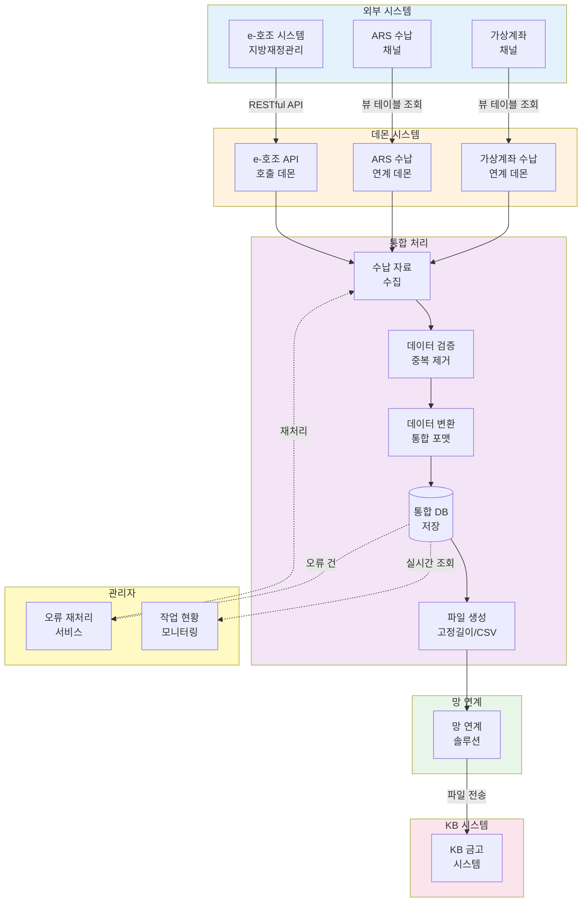
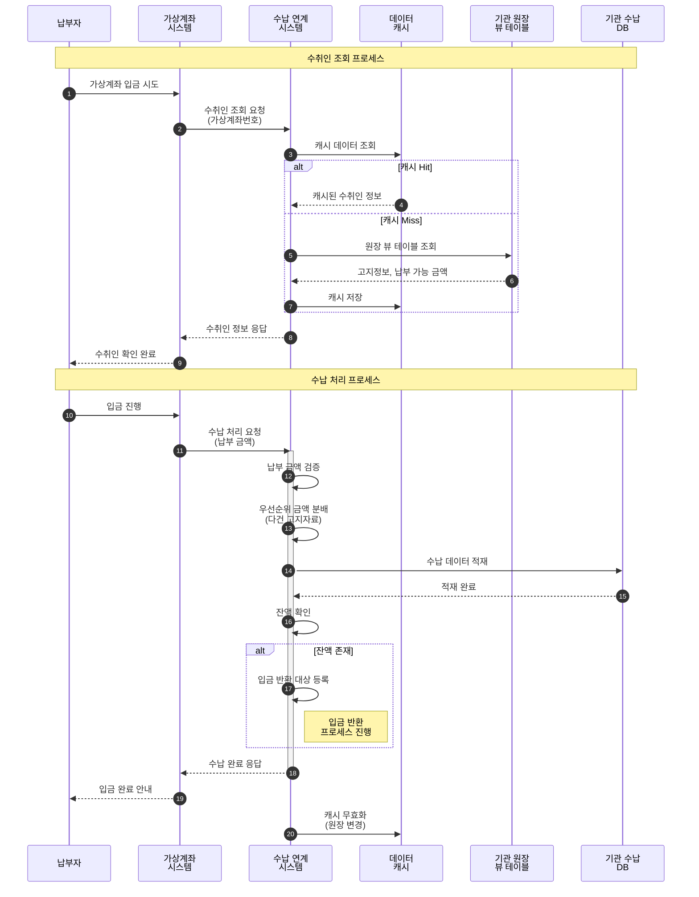
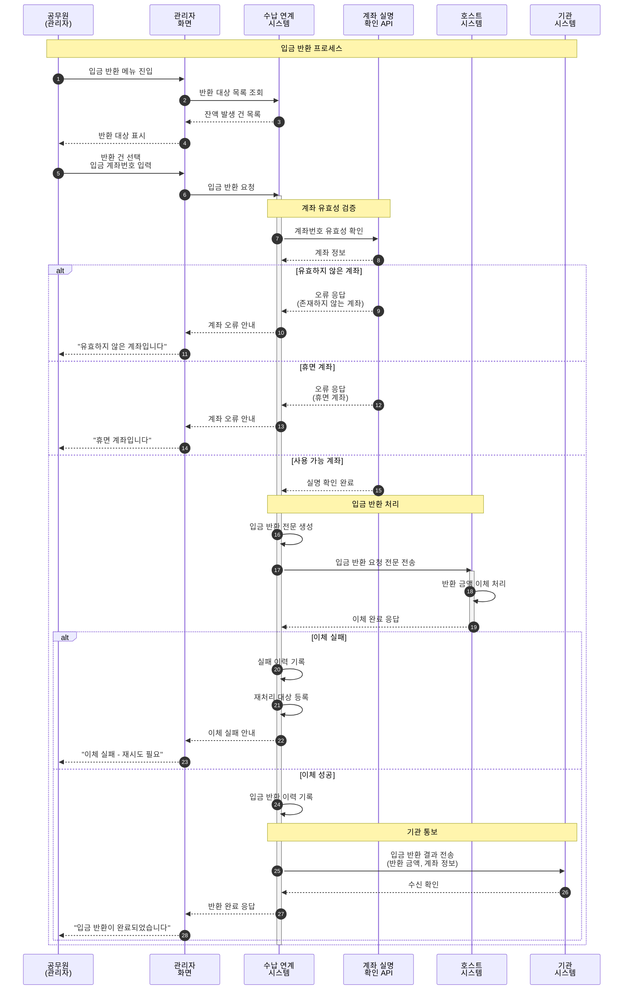

## 프로젝트 개요

KB국민은행의 지방자치단체 금고시스템에 대한 수납, 가상계좌, 보고서 등을 고도화 및 신규 개발했습니다. 지방재정관리시스템(e-호조)과의 연계, 다양한 수납 채널(ARS, 가상계좌) 통합, 유동성 가상계좌 연계 시스템을 구축하여 지방자치단체의 세외수입 수납 업무 효율성을 향상시켰습니다.

## 프로젝트 정보

- **고객사**: KB국민은행
- **포지션**: Front/Back-end
- **개발 인원**: 5명

## 기술 스택

- **Frontend**: JavaScript, jQuery
- **Backend**: Java, Spring Framework
- **Database**: Oracle

## 업무 흐름도

### 1. **수납 자료 연계**

각 기관의 수납 자료를 조회하고 KB 금고 시스템으로 전송하는 프로세스입니다.

#### **기관별 수납 자료 조회**

**1) 지방재정관리시스템(e-호조) API 연동**
- e-호조 시스템 API를 호출하여 수납 자료 실시간 조회
- RESTful API 방식 통신
- 인증 및 보안 처리
- 응답 데이터 파싱 및 검증

**2) 수납 채널별 외부망 뷰 테이블 조회**
- **ARS 수납 채널**: ARS 시스템의 수납 뷰 테이블 조회
- **가상계좌 채널**: 가상계좌 시스템의 수납 뷰 테이블 조회
- 채널별 데이터 포맷 통합 처리
- 중복 데이터 제거 및 검증

#### **수납 자료 DB to File 전송**

- 조회한 수납 자료를 DB에 적재
- 고정 길이 또는 구분자 기반 파일 포맷으로 변환
- 망 연계 솔루션을 통해 KB 금고 시스템으로 전송
- 전송 결과 확인 및 이력 관리

### 2. **유동성 가상계좌 연계**

유동성 가상계좌의 수취인 조회, 수납 처리, 입금 반환을 연계하는 프로세스입니다.

#### **원장 데이터 조회**

- 가상계좌 수취인 조회 시 기관 원장 뷰 테이블 조회
- 수납 시 원장 데이터 확인 및 검증
- 실시간 조회 성능 최적화

#### **수납 데이터 적재**

- 수납 시 발생한 데이터를 기관 수납 테이블에 적재
- 우선순위에 따른 금액 분배 로직
- 다건 고지자료 동시 수납 처리
- 트랜잭션 관리 및 롤백 처리

#### **잔액 입금 반환**

유동성 가상계좌의 특이 업무인 잔액에 대한 입금 반환 프로세스입니다.

**프로세스 플로우**:

1. **공무원 입금 반환 요청**
   - 관리자 화면에서 입금 반환 요청
   - 반환 대상 금액 확인
   - 입금 계좌번호 입력

2. **사용 계좌 여부 확인**
   - 입력된 계좌번호의 유효성 검증
   - 계좌 실명 확인
   - 사용 가능 계좌 여부 확인

3. **입금 반환 처리**
   - 사용 계좌 확인 시 입금 반환 실행
   - 호스트 시스템과 전문 통신
   - 반환 완료 후 기관에 결과 전송
   - 입금 반환 이력 기록

## 담당 업무

### 1. **수납 자료 연계 개발**

다양한 채널의 수납 자료를 통합하여 KB 금고 시스템으로 연계하는 시스템을 개발했습니다.

#### **업무 프로세스 및 테이블 설계**

- **업무 프로세스 분석**
  - 기관별 수납 프로세스 분석
  - 채널별(e-호조, ARS, 가상계좌) 데이터 흐름 정의
  - 연계 시나리오 및 예외 케이스 정의

- **테이블 설계**
  - 수납 자료 통합 테이블 설계
  - 채널별 원천 데이터 테이블
  - 연계 이력 및 오류 관리 테이블
  - 파티셔닝 전략 (일자별)
  - 인덱스 최적화

#### **망 연계 솔루션 포팅**

- 기존 망 연계 솔루션을 수납 시스템 환경에 포팅
- 파일 전송 프로토콜 설정
- 보안 정책 적용
- 전송 성공/실패 처리 로직

#### **지방재정관리시스템(e-호조) API 호출 데몬 개발**

e-호조 시스템과 실시간으로 연동하여 수납 자료를 조회하는 데몬을 개발했습니다.

**주요 기능**:

- **스케줄링**
  - Cron 표현식 기반 정기 실행
  - 업무별 상이한 실행 주기 설정
  - 수동 실행 기능

- **API 호출 처리**
  - e-호조 RESTful API 호출
  - HTTP 통신 및 타임아웃 처리
  - 응답 데이터 JSON 파싱

- **데이터 처리**
  - 수납 자료 검증 및 변환
  - 중복 데이터 필터링
  - DB 배치 Insert
  - 처리 결과 로그 기록

- **에러 핸들링**
  - API 호출 실패 시 재시도 로직
  - 에러 발생 시 관리자 알림
  - 에러 로그 상세 기록

#### **수납 채널별(ARS, 가상계좌) 수납 자료 연계 데몬 개발**

다양한 수납 채널의 데이터를 통합하는 데몬을 개발했습니다.

**주요 기능**:

- **채널별 뷰 테이블 조회**
  - ARS 수납 뷰 테이블 조회 (외부망)
  - 가상계좌 수납 뷰 테이블 조회 (외부망)
  - 조회 조건 동적 생성 (기관, 일자 등)

- **데이터 통합 처리**
  - 채널별 데이터 포맷 표준화
  - 공통 포맷으로 변환
  - 채널 구분 코드 추가
  - 통합 테이블에 적재

- **파일 생성 및 전송**
  - DB 데이터를 파일 포맷으로 변환
  - 고정 길이 또는 CSV 형식
  - 망 연계 솔루션을 통한 파일 전송
  - 전송 완료 확인 및 재전송 로직

#### **관리자 화면 개발**

운영자를 위한 모니터링 및 관리 화면을 개발했습니다.

**1) 기관별 데몬 작업 현황 조회**

- **실시간 모니터링**
  - 기관별 데몬 실행 상태 (실행 중, 대기, 중지)
  - 마지막 실행 시간 및 다음 실행 예정 시간
  - 처리 건수 및 성공/실패 통계
  - 실행 소요 시간

- **상세 조회**
  - 데몬별 실행 이력
  - 처리 건수 및 금액 통계
  - 에러 발생 내역
  - 채널별 수납 현황

- **제어 기능**
  - 데몬 수동 시작/중지
  - 스케줄 변경
  - 긴급 중지 기능

**2) 연계 오류 재처리 서비스**

- **오류 건 조회**
  - 연계 실패 건 목록 조회
  - 오류 유형별 필터링
  - 기관/채널/일자별 조회

- **재처리 기능**
  - 단건 재처리
  - 선택 건 일괄 재처리
  - 전체 재처리 (주의 기능)
  - 재처리 진행 상황 표시

- **오류 분석**
  - 오류 원인 상세 정보
  - 오류 통계 차트
  - 빈번한 오류 패턴 분석

### 2. **수납 채널 분리에 따른 유동성 가상계좌 연계 시스템 개발**

수납 채널이 분리됨에 따라 유동성 가상계좌와의 연계 시스템을 신규 개발했습니다.

#### **연계를 위한 테이블 설계**

- **가상계좌 연계 테이블**
  - 수취인 조회 요청/응답 테이블
  - 수납 처리 요청/응답 테이블
  - 입금 반환 요청/응답 테이블

- **원장 데이터 매핑 테이블**
  - 가상계좌번호 ↔ 고지번호 매핑
  - 우선순위 정보
  - 납부 가능 금액 정보

- **성능 최적화**
  - 조회 성능을 위한 인덱스 설계

#### **가상계좌 수취인 조회 연계 서비스 개발**

가상계좌 거래 시 실시간으로 수취인 정보를 조회하는 서비스를 개발했습니다.

**주요 기능**:

- **실시간 조회 서비스**
  - 가상계좌번호로 수취인 정보 조회
  - 기관 원장 뷰 테이블 조회
  - 고지정보 및 납부 가능 금액 조회

- **데이터 캐싱**
  - 자주 조회되는 데이터 캐싱
  - 캐시 만료 시간 관리
  - 원장 변경 시 캐시 무효화

- **에러 핸들링**
  - 원장 조회 실패 시 처리
  - 타임아웃 처리
  - 에러 응답 코드 정의

#### **가상계좌 수납 연계 서비스 개발**

가상계좌 수납 시 수납 데이터를 기관 시스템에 전송하는 서비스를 개발했습니다.

**주요 기능**:

- **수납 처리 로직**
  - 납부 금액 검증
  - 우선순위에 따른 금액 분배
  - 다건 고지자료 동시 처리
  - 트랜잭션 관리

- **기관 시스템 연계**
  - 기관 수납 테이블에 데이터 적재
  - 전문 통신 또는 DB 연계
  - 수납 완료 응답 처리

- **수납 이력 관리**
  - 수납 내역 상세 기록
  - 분배 금액 내역 기록
  - 수납 상태 관리

#### **수납 후 잔액에 대한 입금 반환 서비스 개발**

유동성 가상계좌의 특성상 발생하는 잔액을 자동으로 반환하는 서비스를 개발했습니다.

**주요 기능**:

- **잔액 발생 감지**
  - 수납 후 잔액 자동 확인
  - 반환 대상 금액 계산
  - 반환 가능 여부 검증

- **계좌 확인 서비스**
  - 입금 계좌번호 유효성 검증
  - 계좌 실명 확인 API 연동
  - 사용 가능 계좌 여부 확인
  - 휴면 계좌 등 예외 처리

- **입금 반환 처리**
  - 호스트 시스템과 전문 통신
  - 입금 반환 전문 생성 및 전송
  - 반환 결과 파싱 및 처리
  - 실패 시 재처리 로직

- **기관 통보**
  - 입금 반환 완료 후 기관에 결과 전송
  - 관리자 화면에 결과 표시

## 개발 구현 내용

### Frontend 개발

1. **jQuery 기반 관리자 화면**
   - 데몬 작업 현황 모니터링 화면
   - 오류 재처리 화면
   - 입금 반환 관리 화면
   - 통계 및 리포트 화면

2. **실시간 모니터링 UI**
   - AJAX 폴링을 통한 실시간 업데이트
   - 차트 및 그래프 시각화

### Backend 개발

3. **Spring Framework**
   - Spring MVC 패턴
   - RESTful API 설계
   - 트랜잭션 관리

4. **데몬 개발**
   - e-호조 API 호출 데몬
   - 수납 채널별 연계 데몬
   - 스케줄러 (Spring Scheduler)
   - 멀티 스레드 처리

5. **수납 자료 연계 시스템**
   - 채널별 데이터 수집
   - 데이터 통합 및 변환
   - 파일 생성 및 전송
   - 오류 처리 및 재처리

6. **유동성 가상계좌 연계 시스템**
   - 수취인 조회 서비스
   - 수납 처리 서비스
   - 입금 반환 서비스
   - 원장 데이터 연계

### Database 개발

7. **Oracle DB**
   - 수납 자료 통합 테이블 설계
   - 채널별 원천 데이터 테이블
   - 가상계좌 연계 테이블
   - 입금 반환 테이블

### 시스템 통합

8. **외부 시스템 연동**
   - 지방재정관리시스템(e-호조) API 연동
   - ARS 시스템 연동
   - 가상계좌 시스템 연동
   - KB 금고 시스템 연동

9. **망 연계 솔루션**
   - 파일 전송 프로토콜
   - 보안 처리
   - 전송 이력 관리
