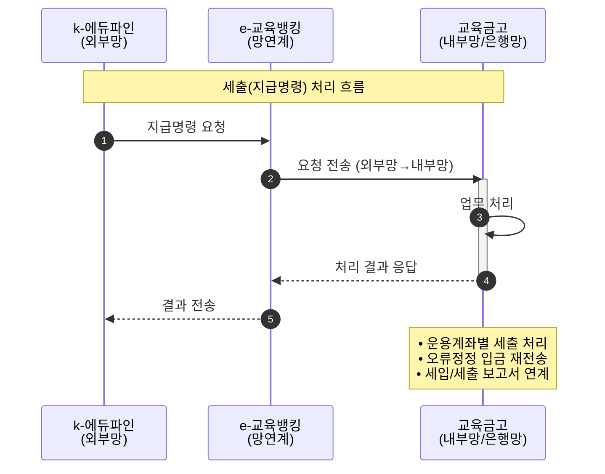

## 프로젝트 개요

교육청과 교육청에 속한 관할기관(교육지원청), 직속기관(학교, 유치원 등)의 교육금고 시스템으로 세입/세출 업무의 자동화 및 뱅킹시스템 연동을 통한 실시간 자금운용관리 연계를 통한 시스템을 구축했습니다.

## 기술 스택

- **Language**: Java
- **Framework**: Spring Framework
- **Database**: Oracle
- **Tools**: 인젠트 단발 개발 툴

## 프로젝트 정보

- **고객사**: KB국민은행, 서울시교육청 및 관할/직속기관
- **개발 인원**: 21명
- **담당 역할**: Back-end, 단말 개발

## 업무 흐름도

사용자(k-에듀파인) → e-교육뱅킹 → **교육금고**

외부망인 k-에듀파인 시스템에서 세출(지급명령)에 대한 요청이 이루어지면 내부망(은행망)으로 요청이 들어오게 되어 해당 업무를 처리하고, 응답결과를 전송합니다.

## 주요 기능

### 1. 공통 모듈
- 시스템 공통 코드 관리
- 공통 팝업 컴포넌트 개발
- 공통 유틸리티 개발

### 2. 운용계좌별 세출 (지급명령)
- 교육청 및 관할기관의 지급명령 처리
- 운용계좌별 세출 거래 관리
- 지급명령 승인/처리 프로세스 구현

### 3. 오류정정 입금 재전송
- 입금 오류 건에 대한 정정 처리
- 재전송 프로세스 자동화
- 오류 이력 관리 및 추적

### 4. 관리계좌별 세입/세출 보고서 연계
- 관리계좌별 세입/세출 데이터 집계
- 보고서 생성 및 전송
- 뱅킹시스템 연계 처리

## 담당 업무

1. **공통 모듈 개발**
   - 코드 관리 시스템 구축
   - 공통 팝업 컴포넌트 개발

2. **운용계좌별 세출(지급명령) 개발**
   - 지급명령 처리 로직 구현
   - 승인 프로세스 개발

3. **오류정정 입금 재전송 개발**
   - 오류 건 재처리 시스템 구현
   - 재전송 자동화 로직 개발

4. **관리계좌별 세입/세출 보고서 연계 개발**
   - 보고서 데이터 생성 및 전송
   - 뱅킹시스템 연동
